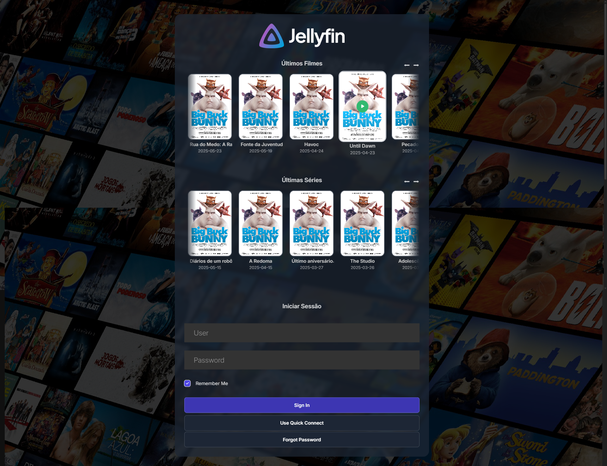

# 🎬 **Jellydash** – A Jellyfin Management Dashboard

**Jellydash** is a dashboard designed to **enhance and simplify** the management of your Jellyfin server, filling the gaps left by the default Jellyfin dashboard.

## ❓ **Why Jellydash?**

Jellyfin’s default dashboard lacks several key features for **granular control**, such as:

- **No built-in user role system** (e.g., "Kids," "Adults," "Admins").

- **No global user config updates** (every change must be manual).
- **Limited sorting options** (defaults to "Date Added," which isn’t always ideal).

With **Jellydash**, you regain control—**without needing external databases** (everything is stored locally).

---

## ✨ **Key Features**

### 🔹 **User & Access Management**

- **Create Packages (Roles)** – Assign access to specific libraries (e.g., "CHILDREN" only shows the content you want children to have access).
- **Bulk-apply settings** – New users inherit their Package’s restrictions automatically.

### 🔹 **Media & Metadata Control**

- **Force-load Cast & Crew pictures** – No more missing pictures!
- **Block tags globally** (e.g., hide "Horror" for users with CHILDREN package).

### 🔹 **Login Page & UI Tweaks**

- **Fully working dynamic carousel** with your latest content!



### 🔹 **Global Customization**

- **Change default sorting** (e.g., sort by content's *Release Date* instead of the date you added the content to your server).

- **Reorder Home libraries for everyone** (e.g., put "TV Shows" before "Movies").

- **Set default subtitle language** for all users.

- **Disable "Latest from…" sections for everyone** – Replace these e.g. for a "Lates from..." for each genre.

---

## 🚀 **Getting Started**

1. **Import** the provided Postman collection (located in root`).
2. **Install dependencies**:

```bash
npm install
```

3. **Configure**:

   - Create a `.env` file with:

```env
SERVER_URL={YOUR_JELLYFIN_SERVER_URL}
```

4. **Run**:

```bash
npm run dev
```

5. Configure your **API_URL** on Postman's variables.

6. Call the **AUTH_BY_NAME** endpoint (you must provide your credentials on the payload), this will add the necessary Jellyfin headers to Postman's global variables so you can make the calls.

---

## 🐣 **First steps**

### 401 Unauthorized

1. If you get this error when trying to make a call, that means you need to refresh the headers. All you need to do is call the **AUTH_BY_NAME** endpoint (you must provide your credentials on the payload).

### Add carousels for latest Movies and TV Show in the Login Page

1. Call **LOGIN_PAGE**. That's it! Now you have two fully working carousels on your login page. All the files for this are located at `app/login-page`, change them as you see fit 😊.

### Import libraries

1. Call **Libraries/SYNC** to import your libraries. This will write all your libraries ID's and names in the `db/libraries/standard` file.

### Make one library Admin only

1. Grab the ID and Name of the library from the `db/libraries/standard` file.
2. Call **ADD_LIBRARY_TO_PACKAGE** with the updated payload (use ADMIN as the package). Repeat the process for each library.
3. Call **Libraries/SYNC** again to remove the Admin libraries.

### Add library to a Package

1. Grab the ID and Name of the library from the `db/libraries/standard` file.
2. Call **ADD_LIBRARY_TO_PACKAGE** with the updated payload. The available packages are STANDARD, CHILDREN, PREMIUM, you can modify these to your use case.
3. Call **Libraries/SYNC** to apply changes.

### Change the order of the libraries in the Home

1. Call **Libraries/All** to get the list of libraries, you will need it for the next call.
2. Re-arrange the order as you want users to see the libraries in the Home.
3. Open **Users/STEP 2 - UPDATE_CONFIGS**, paste the list as the value for `OrderedViews` and make the call.

### Hide "Latest from…" section for some libraries

1.  Call **Libraries/LIBRARY_OUT_OF_HOME** with the library's name on the payload.
2.  Call **Users/STEP 2 - UPDATE_CONFIGS**. You must provide a complete `OrderedViews` list.

### Add a new blocked tag for the CHILDREN package

1.  Call **NEW_BLOCKED_TAG** with the tag on the payload. This endpoint will automatically sync the blocked tags for all users with CHILDREN Package.

### Update Cast & Crew pictures

1.  Call **CAST_CREW_PICTURES** and wait 😊. The first time you call this endpint it might take a while depending on the number of missing pictures you may have. The good news is that this endpoint keeps track of people's IDs so it can skip on next calls.

### Updating content dates for Movies, TV Shows and Episodes

1.  Call the desire endpoint inside of the **Update Create Dates** and wait 😊. This endpoint also keeps track of the IDs so it can skip on next calls.

### Create a new user and assign a Package

1.  Open **Users/STEP 1 - CREAT_USER**, update the payload with the username and the Package name (STANDARD, CHILDREN, PREMIUM). This endpoint automatically creates and returns a new secure password.

#### <u>Be careful with the `OrderedViews` list, this will update the libraries ordering view for all users</u>

2. Call **STEP 2 - UPDATE_CONFIGS** to apply the configs for this newly account and all others.
3. Call **STEP 3 - UPDATE_DISPLAY_PREFERENCES** to apply the Display Preferences for this newly account and all others.

---

## 🔮 **Planned Features**

- **Web-based frontend** Develop the frontend for more convenience.
- **Suggest a feature!** (Open an issue or DM me).

---

## 💡 **Good to Know**

- **No database required** – All data is stored in the project folder.
- **Works alongside Jellyfin** – No conflicts with existing setups.

---

**🌟 Love Jellydash?** Star the repo and help it grow!
