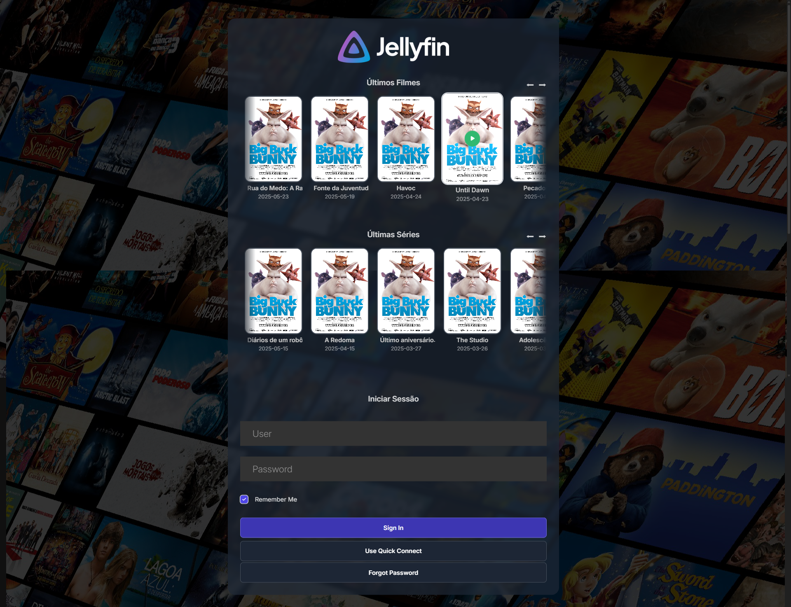

# 🎬 **Jellydash** – A Jellyfin Management Dashboard

**Jellydash** is a dashboard designed to **enhance and simplify** the management of your Jellyfin server, filling the gaps left by the default Jellyfin dashboard.

## ❓ **Why Jellydash?**

Jellyfin’s default dashboard lacks several key features for **granular control**, such as:

- **No built-in user role system** (e.g., "Kids," "Adults," "Admins").

- **No global user config updates** (every change must be manual).
- **Limited sorting options** (defaults to "Date Added," which isn’t always ideal).

With **Jellydash**, you regain control—**without needing external databases** (everything is stored locally).

---

## ✨ **Key Features**

### 🔹 **User & Access Management**

- **Create Packages (Roles)** – Assign access to specific libraries (e.g., "CHILDREN" only shows the content you want children to have access).
- **Bulk-apply settings** – New users inherit their Package’s restrictions automatically.

### 🔹 **Media & Metadata Control**

- **Force-load Cast & Crew pictures** – No more missing pictures!
- **Block tags globally** (e.g., hide "Horror" for users with CHILDREN package).

### 🔹 **Login Page & UI Tweaks**

- **Fully working dynamic carousel** with your latest content!



### 🔹 **Global Customization**

- **Change default sorting** (e.g., sort by content's *Release Date* instead of the date you added the content to your server).

- **Reorder Home libraries for everyone** (e.g., put "TV Shows" before "Movies").

- **Set default subtitle language** for all users.

- **Disable "Latest from…" sections for everyone** – Replace these e.g. for a "Lates from..." for each genre.

---

## 🚀 **Getting Started**

1. **Import** the provided Postman collection (located in root`).
2. **Install dependencies**:

```bash
npm install
```

3. **Configure**:

   - Create a `.env` file with:

```env
SERVER_URL={YOUR_JELLYFIN_SERVER_URL}
```

4. **Run**:

```bash
npm run dev
```

5. Configure your **API_URL** on Postman's variables.

6. Call the **AUTH_BY_NAME** endpoint (you must provide your credentials on the payload), this will add the necessary Jellyfin headers to Postman's global variables so you can make the calls.

---

## 🔐 **Authentication First**

⚠️ **Troubleshooting** → Getting `401 Unauthorized`?  
**Run this first to get your access token:**

```http
POST /users/authenticate-by-name
Payload: {"Username": "YourAdmin", "Pw": "YourPassword"}
```

✅ **Success**: Saves `ACCESS_TOKEN` automatically for future calls.

---

## ✨ **Key Features Setup**

### 🖼️ **1. Dynamic Login Page Carousels**

```http
PATCH /login-page
```

✅ **What it does**:

- Adds carousels for *Latest Movies* and *TV Shows* to the Login Page
- Files: `app/login-page/` (customize styles easily!)

---

### 📚 **2. Library Management**

#### 🔄 **Import Libraries**

```http
PATCH /libraries/update-libraries
```

📁 **Output**: Saves to `db/libraries/standard`

#### 🔒 **Restrict Library Access (Admin-Only)**

```http
POST /add-to-package
Payload: {"id": "lib123", "name": "4K Movies", "package": "ADMIN"}
```

⚠️ **Warning**: Call `GET /libraries/sync` after to apply changes.

#### 🏠 **Reorder Home Screen Libraries**

1. Fetch current order:

```http
GET /libraries/all
```

2. Update globally:

```http
POST /users/update-configs
Payload: {"OrderedViews": ["id1->Movies", "id2->TV Shows"]}
```

⚠️ **Affects all users!**

#### 🔄 **Force Jellyfin to add/update a library with new paths**

When changing library paths to new ones, Jellyfin sometimes might still keep the old ones. This can create all kind of issues like content duplication that won't work when trying to playblack.

```http
PATCH /force-new-library-paths/?name={libraryName}
```

Payload example

```json
{
  "PreferredMetadataLanguage": "pt",
  "MetadataCountryCode": "PT",
  "AllowEmbeddedSubtitles": "AllowNone",
  "PathInfos": ["A:\\Movies\\MovieGenre", "A:\\Movies\\MovieGenreTwo"]
}
```

---

### 🛡️ **3. Content Filtering**

#### 🚫 **Block Tags (e.g., for Kids)**

```http
POST /blocked-tags
Payload: {"tag": "violence"}
```

✅ **Auto-syncs** to all users with `CHILDREN` package.

---

### 🎭 **4. Media Enhancements**

#### 📸 **Fix Missing Cast & Crew Photos**

```http
PATCH /persons?userId=USER_ID
```

⏳ **First run**: May take time (processes all missing images).  
✅ **Optimized**: Skips processed IDs in future runs.

#### 📅 **Update Content Dates**

```http
PATCH /items/update-date-created?IncludeItemTypes=Movie
```

**Also available**: Replace `Movie` with `Series` or `Episode`.

---

### 👥 **5. User Management**

#### ✨ **Create New User**

```http
POST /users/new
Payload: {"username": "Bob", "package": "PREMIUM"}
```

🔑 **Returns**: Auto-generated secure password.

#### ⚙️ **Apply Default Settings**

1. **Configs**:

```http
POST /users/update-configs
```

2. **Display Preferences**:

```http
POST /users/update-display-prefs
```

---

## ⚠️ **Critical Notes**

- **`OrderedViews` changes apply globally** → Double-check before saving!
- **Packages**: `STANDARD` | `CHILDREN` | `PREMIUM` | `ADMIN` (edit in `config/packages.json`).
- **First-run delays**: Media updates may take time (later calls are faster).

---

## 🎨 **Pro Tips**

1. **Customize packages**: Edit `config/packages.json`
2. **Style login carousels**: Modify `app/login-page/styles.css`

---

## 🔮 **Planned Features**

- **Web-based frontend** Develop the frontend for more convenience.
- **Suggest a feature!** (Open an issue or DM me).

---

## 💡 **Good to Know**

- **No database required** – All data is stored in the project folder.
- **Works alongside Jellyfin** – No conflicts with existing setups.

---

**🌟 Love Jellydash?** Star the repo and help it grow!
