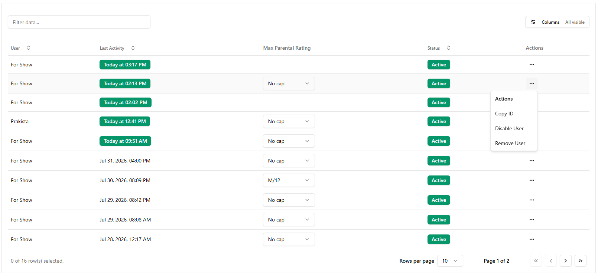
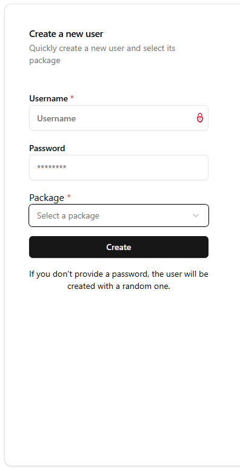
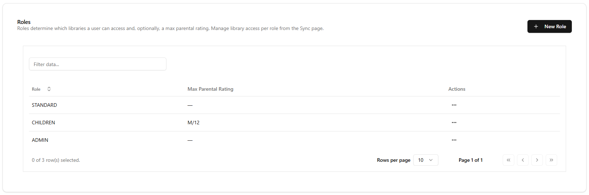
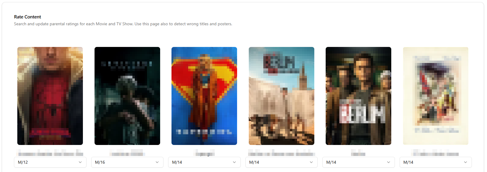
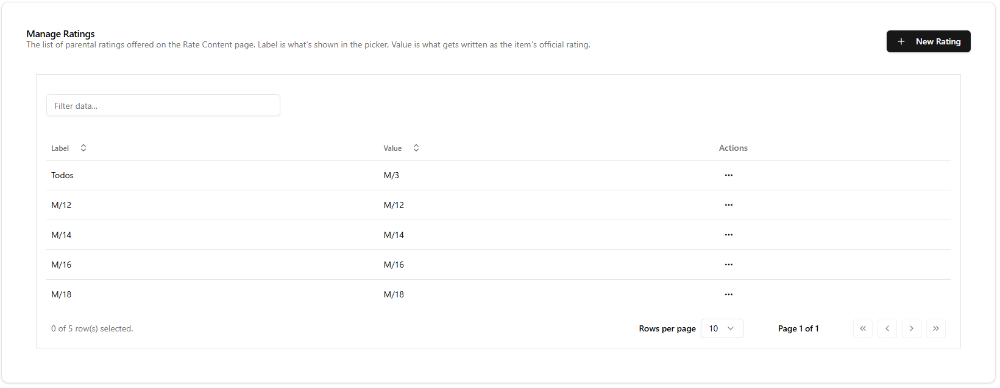
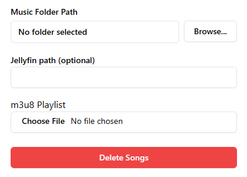
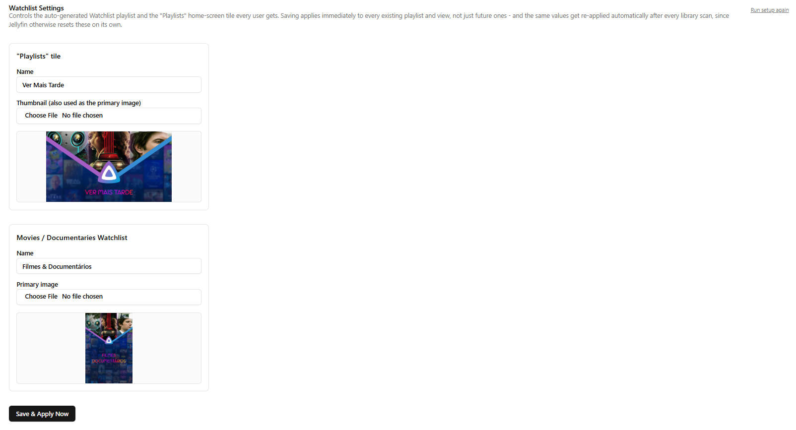
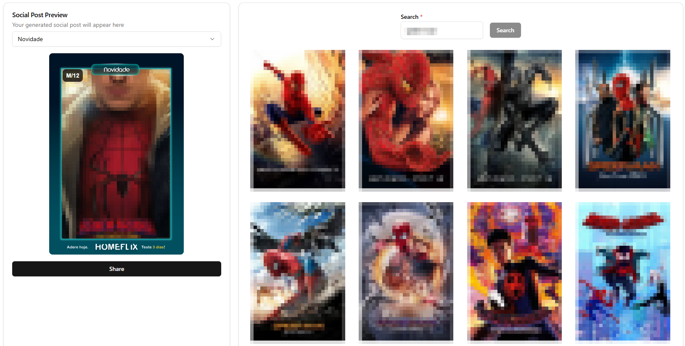
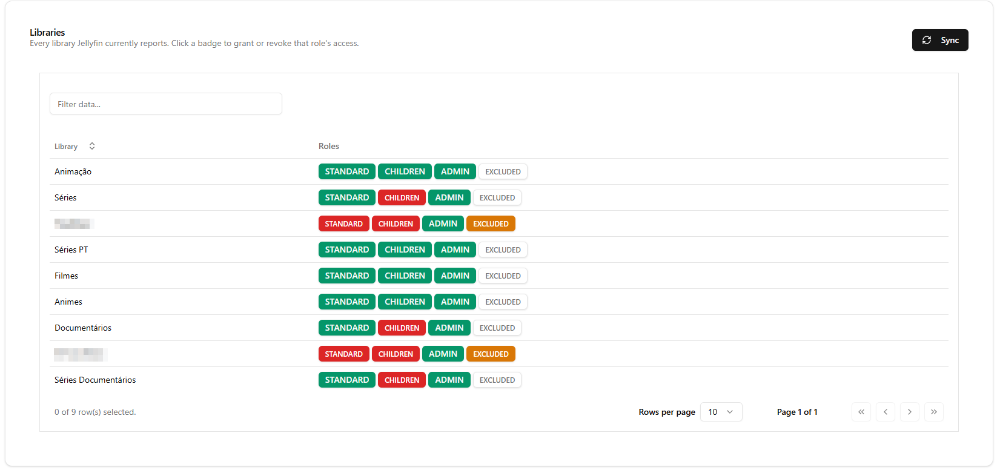

# 🎬 **Jellydash** – A Jellyfin Management Dashboard

**Jellydash** is a self-hosted web dashboard that **enhances and simplifies** the management of your Jellyfin server, filling the gaps left by the default Jellyfin dashboard.

It ships as a full Next.js web app — log in with your existing Jellyfin admin account and manage users, libraries, and content straight from the browser. No separate accounts, no external database.

---

## ❓ **Why Jellydash?**

Jellyfin's default dashboard lacks several key features for **granular control**, such as:

- **No built-in user role system** (e.g., "Children," "Adults," "Admins").
- **Ratting content** Ratting content must be done one-by-one.
- **Lack of Watchlist feature** Users are forced to look for the Favorite filter on each client which can be cumbersome e.g. TV Client.

And more.

With **Jellydash**, you regain control — **without needing external databases** (everything is stored locally in the project folder).

---

## ✨ **Key Features**

### 🔹 **User Management**

- **Browse and manage users** in a searchable table, with a per-user **Max Parental Rating**, **Disable User**, **Remove User** and **Can Download** options.
  
- **Create new users** with a **package** that controls which libraries and permissions they get, plus an auto-generated secure password.
  
- **Roles** – Create, rename, or delete roles. Each role can optionally have a **Max Parental Rating** cap.
  

### 🔹 **Content Management**

- **Parental Ratings** – parent menu with two pages:
  - **Rate Content** – Paginated grid of every Movie/Show, letting you fix wrong titles, posters, and official ratings in bulk.
    
  - **Manage Ratings** – Add, rename, or remove the ratings offered on the Rate Content page.
    
- **Delete Playlist Songs** – Upload an **`.m3u8` playlist** (from any app — Symfonium, VLC, etc) and permanently delete every listed song from disk.
  
- **Watchlist Settings** – Setup and manage the Watchlist feature for you and your users!
  
- **Social Post** – Shareable social-media poster with custom template option.
  
- **Sync Crew & Cast** – Refreshes cast/crew photos that are missing from Jellyfin. Tracks what's already been processed so re-runs only touch what's still missing, or force a full re-sync.

### 🔹 **Libraries**

- **Sync** – Table of every library Jellyfin reports, with a badge per role (plus an `EXCLUDED` badge) — click a badge to grant or revoke that library for that role on the spot.
  
- **Reorder Home** – Drag-and-drop the home screen's library order, exclude/restore libraries from the same list, and push the new order to every user. The Playlists tile is shown pinned first since Jellyfin forces that position regardless.
- **Add Library to Role** – Pick a role, then check off which libraries it can access.

---

## 🚀 **Getting Started**

1. **Install dependencies**:

```bash
npm install
```

2. **Configure your `.env`** (see the **Environment Variables** section below).

3. **Run** (the dev server runs on **port 4000**, not 3000):

```bash
npm run dev
```

4. Open `http://localhost:4000/login` and sign in with your **Jellyfin admin username and password** — Jellydash authenticates you directly against your Jellyfin server, so there's no separate account to create.

---

## 🔧 **Environment Variables**

```env
# Your actual Jellyfin server
SERVER_URL={YOUR_JELLYFIN_SERVER_URL}

# NextAuth (Jellydash's own login session)
NEXTAUTH_SECRET={RANDOM_SECRET}
NEXTAUTH_URL={YOUR_JELLYDASH_APP_URL}
NEXT_SERVER_ACTIONS_ENCRYPTION_KEY={RANDOM_SECRET}

# Admin API key used for server-side/webhook calls to Jellyfin
JELLYFIN_ADMIN_API_KEY={YOUR_JELLYFIN_API_KEY}

# Shared secret required on incoming Jellyfin webhook calls
WEBHOOK_SECRET={RANDOM_SECRET}

# Optional debugging
REQUEST_LOGS=true
DEBUG_JELLYFIN_ENDPOINT=/api/webhooks

# Poster image hosting (used to build public image URLs)
NEXT_PUBLIC_IMAGE_PROTOCOL=https
NEXT_PUBLIC_IMAGE_HOSTNAME={YOUR_JELLYFIN_HOSTNAME}
NEXT_PUBLIC_ALLOWED_DEV_ORIGIN={YOUR_DEV_ORIGIN}

# Needed by the media re-encode endpoint below (Windows paths to your Jellyfin server's ffmpeg/ffprobe)
FFMPEG_PATH=C:\Program Files\Jellyfin\Server\ffmpeg.exe
FFPROBE_PATH=C:\Program Files\Jellyfin\Server\ffprobe.exe
```

The Watchlist playlist's name/poster and the "Playlists" tile's name/thumbnail are **not** env vars - they're managed from **Content Management → Watchlist Settings** (see below).

## 🔐 **Authentication**

Signing with an account that has admin permissions, that's all!

---

### 📚 **Library Sync**

## Shows every library Jellyfin currently reports in a table (Library, Roles).

### 👤 **Roles**

Lists every role from `app/db/roles.json`:

- **New Role** – creates a role with an empty library file; grant it libraries from the Sync page afterward.
- **Edit Role** – rename it and/or set a Max Parental Rating, picked from the same list managed on **Parental Ratings → Manage Ratings** (or "No cap"). The role's `id` (and its underlying library file) never changes, even if you rename it.
- **Delete Role** – removes the role and its library file. Existing users keep whatever permissions they already have.

---

### 🎵 **Delete Playlist Songs**

Available in the dashboard under **Content Management → Delete Playlist Songs**. Accepts any `.m3u8` playlist file — it doesn't have to come from Symfonium, that's just the app used to originally export the sample playlists. On the page you:

1. Pick the **Music Folder Path** with the built-in folder browser (browses folders directly on the server's own disks).
2. Optionally set the **Jellyfin path**, if the paths inside the `.m3u8` are container paths (e.g. `/media/F/Music/...` from a Dockerized Jellyfin) that need translating back to the real path on disk.
3. Upload the `.m3u8` file and confirm.

Each song is checked against the chosen folder before deletion (anything outside it is skipped, never deleted), and the response reports exactly what was deleted, not found, skipped, or errored.

---

### 🎬 **Watchlist Settings**

Available under **Content Management → Watchlist Settings**. Controls two things:

- The **auto-generated Watchlist playlist** every user gets when they favorite a Movie/Video - its name and primary image.
- The shared **"Playlists"** home-screen tile - its name and thumbnail.

Saving applies immediately to every playlist/view that already exists, not just future ones.

**First-time setup wizard**: the first time you open this page (or any time via the "Run setup again" link), a 4-step wizard walks through everything needed instead of doing it by hand:

1. Explains what the feature does.
2. Confirms Jellydash can reach your Jellyfin server, then installs the Webhook plugin from Jellyfin's official catalog.
3. Restarts Jellyfin (required for a freshly-installed plugin to activate) and confirms the server is back up.
4. Applies the two Generic Destinations described below (auto-generating and embedding the shared secret - nothing to copy/paste), lets you double check they're there, and can create the Watchlist playlist for every user right away.

The wizard only ever adds/replaces its own two destinations - any other webhook destinations you've already configured (Discord, Slack, etc.) are left alone. Everything it does can also still be set up by hand:

A Jellyfin webhook (notification type `UserDataSaved`) listens for favorites and adds them to the right watchlist playlist automatically; a one-off backfill endpoint (`/api/webhooks/jellyfin-favorite/backfill`) exists to catch up on favorites that existed before the webhook was wired up.

Jellyfin's own library scan periodically regenerates these images (and can reset the "Playlists" tile's name) on its own - there's no way to stop that from happening, so a second webhook exists to put things back right after: in Jellyfin's Webhook plugin, add a **Generic Destination** with notification type **Task Completed** (scope it to just "Scan Media Library" if the plugin lets you), pointed at:

```
{APP_URL}/api/webhooks/jellyfin-task-completed?secret={WEBHOOK_SECRET}
```

If `WEBHOOK_SECRET` isn't set in `.env`, one is generated automatically and stored in `app/db/webhook-secret.json` the first time it's needed (by the wizard, or by either webhook route).

---

## ⚠️ **Critical Notes**

- **Dev server runs on port 4000**, not the Next.js default 3000.
- **Packages/Roles**: Each has its own independent library file under `app/db/libraries/` — granting a library to one role has no effect on the others. Roles themselves live in `app/db/roles.json`, managed from **User Management → Roles**.
- **Ratings**: The list offered on the Rate Content page lives in `app/db/ratings.json`, managed from **Parental Ratings → Manage Ratings**. Deleting a rating doesn't change items already tagged with it in Jellyfin.
- **Watchlist**: Names live in `app/db/watchlist-settings.json`, images in `public/watchlist-*-image.png` - both managed from **Content Management → Watchlist Settings**.
- **Delete Playlist Songs is destructive and irreversible** — it deletes real files from disk. The folder-path safety guard only stops it from deleting _outside_ the folder you picked; it won't stop you from picking the wrong folder.
- **First-run delays**: media/photo updates may take time (later calls are faster, since processed IDs are skipped).
- **Homepage Order**: lives in `app/db/ordered-views`, managed from **Libraries → Reorder Home**. Playlists always shows first.
- **Sync Crew & Cast**: already-processed people are tracked in `app/db/faceless`, so re-runs only touch what's still missing an image. Use Force to redo everyone.

---

## 🔮 **Planned Features**

- **Nothing planned for now**
- **Suggest a feature!** (Open an issue or DM me.)

---

## 💡 **Good to Know**

- **No database required** – All data is stored as files in the project folder (`app/db/`).
- **Works alongside Jellyfin** – No conflicts with your existing setup; Jellydash just talks to Jellyfin's API.

---

**🌟 Love Jellydash?** Star the repo and help it grow!
